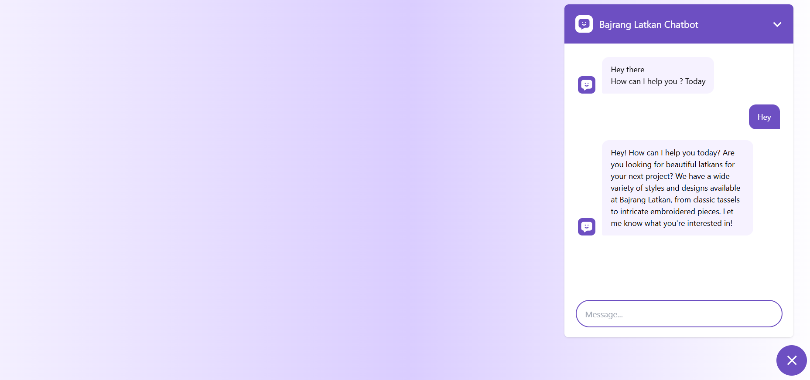
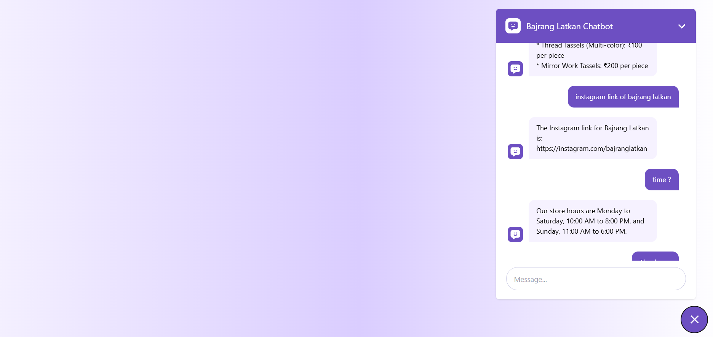
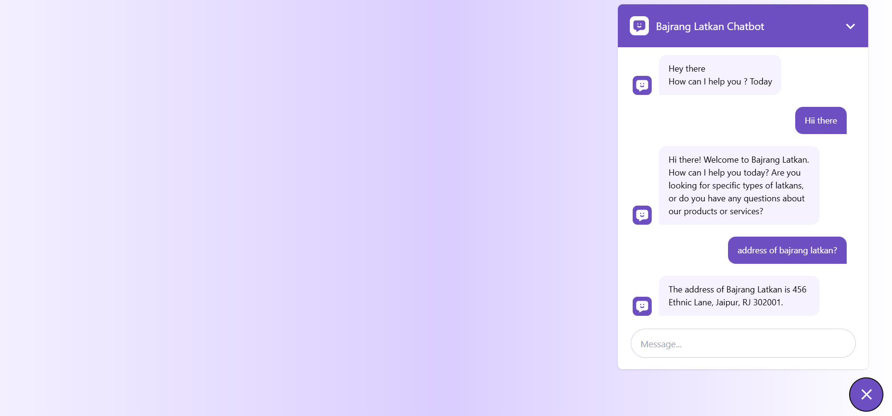

# 🤖 Bajrang Latkan Chatbot

Welcome to the **Bajrang Latkan Chatbot** repository! 🌟 This chatbot is designed to provide a seamless and interactive experience for customers exploring Bajrang Latkan's premium collection of traditional embellishments. It serves as a virtual assistant, offering product information, handling inquiries, and making shopping more engaging and efficient.



---

## ✨ Features

- 💬 **Interactive Conversations**: Provides an intuitive chat experience for customers.
- 📦 **Product Information**: Displays detailed descriptions and pricing for latkans.
- ⚡ **Quick Assistance**: Answers common queries about products, store hours, and contact details.
- 🎨 **Customizable Options**: Helps users explore personalized latkan options.
- 🌐 **Smooth Navigation**: Guides users to the Bajrang Latkan website for a seamless shopping experience.

---

## 🛠️ Tech Stack

- **Frontend**: ⚛️ ReactJS, 🌈 Tailwind CSS
- **API**: 🔗 Gemini API
- **Deployment**: 🚀 Vercel

---

## 🔍 How It Works

1. **User Interaction**: The chatbot initiates a conversation to assist with product inquiries.
2. **Product Details**: Users can request information about specific latkans or browse categories.
3. **Recommendations**: The bot suggests popular or seasonal products based on user preferences.
4. **Store Info**: Provides details like store location, hours, and contact information.
5. **Guidance**: Directs users to the website or connects them to customer support for additional help.

---

## ⚙️ Installation

1. Clone this repository:
   ```bash
   git clone https://github.com/mkkapadi12/BajrangLatkan-Chatbot.git
   ```
2. Navigate to the project directory:
   ```bash
   cd BajrangLatkan-Chatbot
   ```
3. Install dependencies:
   ```bash
   npm install
   ```
4. Start the development server:
   ```bash
   npm start
   ```
5. Open your browser and go to `http://localhost:5173`.

---

## 🖼️ Screenshots

### 🛍️ Product Inquiry


### 🏢 Store Details


---

## 🚀 Future Enhancements

- 🌎 **Multilingual Support**: Add support for regional languages.
- 💳 **Payment Assistance**: Enable the chatbot to assist with payments and checkout.
- 👤 **User Accounts**: Personalize the experience by linking user accounts.
- 📊 **Analytics**: Integrate data analytics to understand user behavior.

---

## 🤝 Contributing

We welcome contributions! Please feel free to fork the repository, create a new branch, and submit a pull request. Ensure your code follows the project's coding standards.

---

## 📄 License

This project is licensed under the MIT License. See the [LICENSE](LICENSE) file for more details.

---

## 📞 Contact

For questions, feel free to reach out:

- 📧 **Email**: support@bajranglatkan.com
- 🌐 **Website**: [Bajrang Latkan](https://bajrang-2-0.vercel.app/)

---

We hope you enjoy using the Bajrang Latkan Chatbot as much as we enjoyed building it! 🎉

